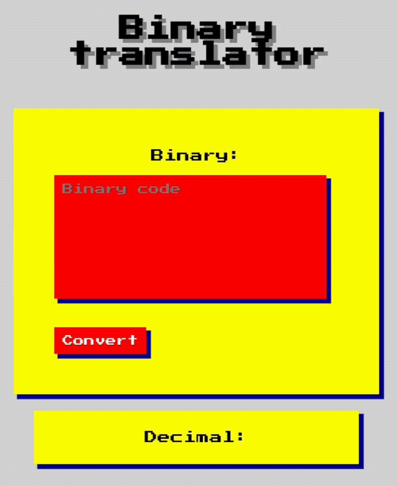

# Tradutor de codigo binário 

link: <a href="binary-to-decimal-converter-livid.vercel.app">binary-to-decimal-converter-livid.vercel.app</a>

Um app simples para converter código binario em decimal!

